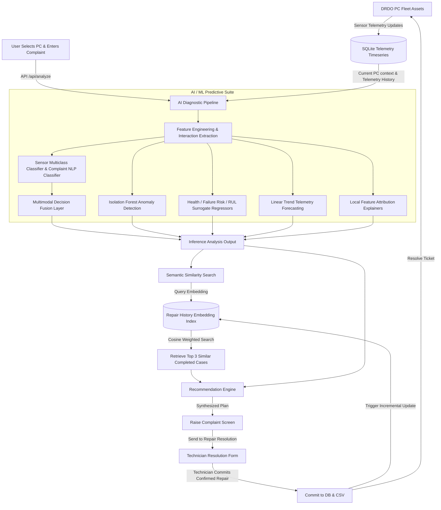

# AI-Powered Organizational PC Health, Historical Repair Intelligence, and Predictive Maintenance Ecosystem

## Project Overview
This platform is an academic/demo enterprise system designed for the **DRDO** organization theme to manage and maintain PC assets across departments. It integrates **predictive AI/ML telemetry models** (anomaly detection, health scoring, failure risk forecasting, and RUL estimation) with a **semantic NLP search index** over completed repairs. 

When a user raises a complaint, the AI performs diagnostic assessments on telemetry signals and semantic text inputs, dynamically retrieves the **Top 3 similar historical completed repairs**, and synthesizes an **evidence-based maintenance recommendation** for technicians. Once a repair is completed, the feedback loop immediately re-indexes the new repair in the semantic search space, making it instantly retrievable for future incidents.

---

## System Architecture



---

## AI/ML Module Architectures

1. **Advanced Feature Engineering**: Extends raw sensor metrics into 15+ complex indicators like `TemperatureStress` (threshold 75°C), `VoltageDeviation` (nominal 15V), `CoolingEfficiencyProxy`, `FanTemperatureMismatch`, `DiskStressIndex`, and polynomial interactions.
2. **Sensor Multiclass Problem Classifier**: Predicts categories (`Overheating`, `Memory Leak`, `Disk Failure`, `Power Issue`, `No Problem`) using an optimized tree-based classifier trained on raw telemetry mappings.
3. **Complaint NLP Classifier**: Logistic Regression with TF-IDF vectorization mapped on historical text logs to predict categorical faults.
4. **Multimodal Fusion**: Compares sensor classifier outputs with NLP classifier predictions to yield a final problem assessment and agreements status.
5. **Isolation Forest**: Detects hardware anomalies based on normal operating baseline configurations.
6. **Predictive Health, Failure Probability & RUL**: Regressors and classifiers trained on engineered degradation targets.
7. **Telemetry Trend Forecasting**: Performs linear regression over historical timeseries telemetry logs (minimum 3 history points).
8. **Explainability**: Outputs top 5 feature attributions using model feature importances scaled by current PC deviations from healthy baselines.
9. **Semantic Search Index**: Calculates cosine similarity on SBERT embeddings (falls back to custom local TF-IDF model if offline) using weighted metrics:
   $$\text{FinalSimilarity} = 0.55 \cdot \text{Complaint} + 0.20 \cdot \text{Symptoms} + 0.15 \cdot \text{ProblemType} + 0.10 \cdot \text{ModelContext}$$
10. **K-Means Clustering**: Clusters the fleet into 4 operational segments (`Stable`, `High-Utilization`, `Elevated-Thermal`, `Voltage-Instability`) based on centroid characteristics.

---

## Project Structure

```
drdo final/
├── backend/
│   ├── app/
│   │   ├── main.py                     # FastAPI entrypoint
│   │   ├── config.py                   # Global system constants & thresholds
│   │   ├── database.py                 # SQLite SQLAlchemy session configuration
│   │   ├── api/
│   │   │   ├── pcs.py                  # PC fleet listing, details, telemetry logs
│   │   │   ├── predictions.py          # AI diagnostic pipeline (/api/analyze)
│   │   │   ├── repairs.py              # Completed repairs logs & submits
│   │   │   └── dashboard.py            # Aggregate dashboard statistics
│   │   ├── models/
│   │   │   ├── database_models.py      # SQLAlchemy schemas (SQLite tables)
│   │   │   └── schemas.py              # Pydantic validation schemas
│   │   ├── services/
│   │   │   ├── pc_service.py           # PC CRUD & CSV synchronization
│   │   │   ├── prediction_service.py   # Multi-model inference, fusion & forecasting
│   │   │   ├── embedding_service.py    # Dual SBERT / TF-IDF semantic indexes
│   │   │   ├── similarity_service.py   # Weighted similarity retrieval engine
│   │   │   ├── recommendation_service.py # Actionable synthesis engine
│   │   │   └── risk_service.py         # Qualitative level mapping formulas
│   │   └── ml/
│   │       ├── feature_engineering/    # Advanced mathematical metrics
│   │       ├── explainability/         # Local feature attributions
│   │       └── clustering/             # KMeans PC segmentation
│   ├── train.py                        # ML training & model serialization pipeline
│   ├── seed_database.py                # Initializes SQLite from CSV inputs
│   └── tests/                          # 13+ Unit and Integration Pytests
├── frontend/
│   ├── src/
│   │   ├── components/                 # Visual elements, cards, layouts
│   │   ├── pages/                      # Dashboard, RaiseComplaint, RepairResolution, Fleet, History
│   │   ├── services/                   # Fetch API wrapper (api.js)
│   │   └── App.jsx                     # Dashboard shell and routing controller
│   ├── package.json
│   ├── vite.config.js
│   ├── tailwind.config.js
│   └── postcss.config.js
├── organization_pcs.csv                # Master PC list (source)
├── repair_history.csv                  # Completed repairs list (source)
├── models/                             # Output model binaries (serialized)
└── README.md                           # Documentation
```

---

## Installation & Setup Instructions

### Prerequisites
* Python 3.9+
* Node.js v16+
* npm

### 1. Backend Setup
Activate the virtual environment located under `C:\Users\jahan\.gemini\antigravity\scratch\MotherboardHealthAI\.venv` (or initialize a new one in the backend directory):
```bash
# Navigate to backend directory
cd "C:\Users\jahan\OneDrive\Desktop\drdo final\backend"

# Seed SQLite database from current CSVs
..\..\..\.gemini\antigravity\scratch\MotherboardHealthAI\.venv\Scripts\python.exe seed_database.py

# Train models and generate embeddings
..\..\..\.gemini\antigravity\scratch\MotherboardHealthAI\.venv\Scripts\python.exe train.py

# Start FastAPI Uvicorn server
..\..\..\.gemini\antigravity\scratch\MotherboardHealthAI\.venv\Scripts\python.exe -m uvicorn app.main:app --host 127.0.0.1 --port 8000 --reload
```

### 2. Frontend Setup
```bash
# Navigate to frontend directory
cd "C:\Users\jahan\OneDrive\Desktop\drdo final\frontend"

# Install Node dependencies
npm install

# Start Vite React server (runs on http://localhost:5173)
npm run dev
```

### 3. Running Automated Tests
```bash
# From the backend directory:
..\..\..\.gemini\antigravity\scratch\MotherboardHealthAI\.venv\Scripts\python.exe -m pytest tests/
```

---

## Synthetic Data Disclaimer
All PC records, incident locations, departments, employee identities, telemetry metrics, and repair logs are synthetic and created purely for academic demonstration and simulation. They do not represent real-world incidents, infrastructure, operational failures, or assets of the DRDO or any other organization.
